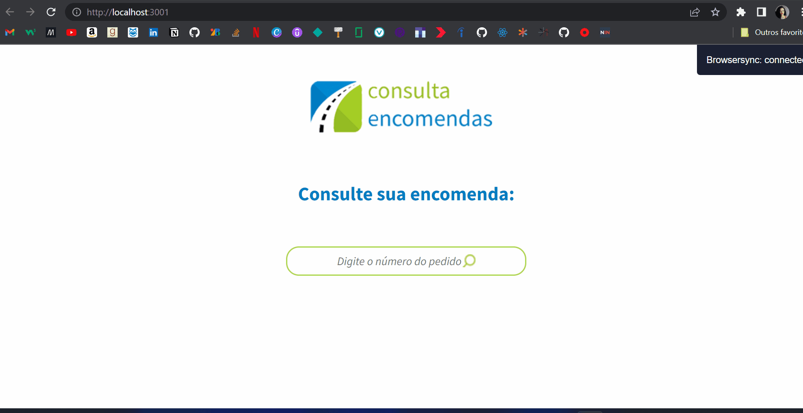

# Teste técnico para o cargo de Desenvolvedor FrontEnd da Nitro

Projeto seguindo as especificações abaixo:

## Objetivo

* Fazer a codificação do layout proposto (está dentro da pasta layout);
* Entregar o código fonte, junto com a automação para gerar nos ambientes de desenvolvimento e produção;
* Fazer a consulta do JSON (dados.json), e mostrar na tela o resultado (usar XMLHttp​Request ou Fetch API);
* Se o usuário pesquisar um código que não existe (ex.: QWE-728), mostrar a tela de erro (tem no layout);
* O resultado deve exibir os seguintes dados:
    + Número de ordem (cliente.id) - nome do cliente (cliente.nome)
    + Data do pedido (formato dd/mm/aaaaa)
    + Valor do pedido (formatado em reais e não pode aparecer na versão mobile)
    + Se entregue, colocar 'entregue', se não, colocar 'entregar'

## Obrigatório

* Não usar nenhum framework ou library (ex.: Bootstrap, jQuery e etc...);
* Código Cross-browser (suporte para a última versão de cada browser);
* Escrever o JavaScript em ES6+ (JS Moderno);
* Escrever o HTML da forma mais semântica possível;
* Usar algum pré-processador CSS ([Sass](http://sass-lang.com), [Less](http://lesscss.org), [Stylus](http://stylus-lang.com));
* Utilizar alguma automatização (task runner ou bundler), como por exemplo: [Gulp](http://gulpjs.com), [Grunt](http://gruntjs.com), [webpack](https://webpack.js.org/) ou [NPM Scripts](https://docs.npmjs.com/misc/scripts).

> Seu teste precisa ter um comando de build (ex.: `npm run build`), que gere para uma pasta os arquivos para produção, utilizando alguma ferramenta de automação, sendo da seguinte forma:

* HTML = Minificado;
* CSS = Todos em um único arquivo e minificado;
* JS = Gerar em ES5 e minificado.

## Para rodar:
* npm install
* npm run dev
* npm run build
* json-server --watch dados.json 

## Feito Com:

